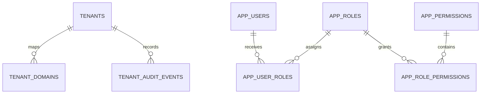

# Platform foundation tables

## Scope

This is the identity and tenancy foundation extracted from CXApp on 2026-10-05.
It excludes product, billing, subscription, queue, storage, and other business
tables. CXApp uses MariaDB with two database scopes:

- The **Platform master database** holds global platform identities, sessions,
  recovery records, and the tenant registry.
- Each **tenant database** holds that tenant's users and RBAC data. It has no
  `tenant_id` column because the selected database is the tenant boundary.

All listed records use an integer primary key, a unique eight-character `uuid`,
and the common audit fields `created_by`, `created_at`, `updated_at`, and
`status` unless a table-specific definition below says otherwise.

## Platform master database

| Table | Purpose | Identity fields and constraints |
| --- | --- | --- |
| `tenants` | Tenant registry and database connection metadata. | `tenant_code`, `slug`, and `corporate_id` are unique. Stores tenant name and status; database type, host, port, name, user, and secret reference; enabled modules, default landing app, and payload settings. |
| `tenant_domains` | Maps a host name to one tenant. | `tenant_id` references `tenants.id` with cascade delete. `domain` is unique. Stores primary flag, active or disabled status, verification state, token hash, and verification time. |
| `platform_auth_users` | Credential-bearing Platform staff and super-admin identities. | Composite unique key on `(user_type, email)`. Stores name, password hash, and active or inactive status. `user_type` is `staff` or `super_admin`. |
| `auth_sessions` | Revocable session registry for staff, super-admin, and tenant sessions. | `jti` is unique. Stores user identity snapshot, tenant ID/code/database, access mode, login host, safe context JSON, expiry, last-seen time, and optional revocation time. Indexed by `(user_type, user_uuid)`, `tenant_id`, and `expires_at`. |
| `auth_login_attempts` | Shared sign-in throttling across API processes. | `attempt_key_hash` is unique. Stores failure count, last failed time, and blocked-until time. `blocked_until` is indexed. No raw email, IP, or credential value is stored. |
| `password_reset_requests` | One-time password recovery records. | `token_hash` is unique. Stores desk (`admin`, `sa`, or `tenant`), user UUID, email, optional tenant reference, expiry, and consumption time. Indexed for token lookup and expiry. |
| `tenant_audit_events` | Minimal master-side tenant lifecycle audit trail. | `tenant_id` references `tenants.id` with cascade delete. Stores event name and actor email. Indexed by `tenant_id`. |

## Tenant database

Each tenant gets this identity and RBAC schema in its own database. The tables
are prefixed with `app_`.

| Table | Purpose | Identity fields and constraints |
| --- | --- | --- |
| `app_users` | Tenant login identities. | `email` and `uuid` are unique. Stores name, password hash, legacy default `role`, active/inactive/suspended status, and `is_protected`. The role column is not the permission authority; role assignments use `app_user_roles`. |
| `app_roles` | Tenant-local roles. | `key` and `uuid` are unique. Stores label, description, active or inactive status, and `is_protected`. |
| `app_permissions` | Tenant-local permission vocabulary. | `key` and `uuid` are unique. Stores label, description, active or inactive status, and `is_protected`. |
| `app_user_roles` | User-to-role assignment. | Unique `(user_id, role_id)`. `user_id` references `app_users.id` and `role_id` references `app_roles.id`; both cascade on delete. Stores active or inactive status and `is_protected`. |
| `app_role_permissions` | Role-to-permission grant. | Unique `(role_id, permission_id)`. `role_id` references `app_roles.id` and `permission_id` references `app_permissions.id`; both cascade on delete. Stores active or inactive status and `is_protected`. |
| `app_module_settings` | Tenant module activation and safe module settings. | `module_key` and `uuid` are unique. Stores enabled flag, settings JSON, and active or inactive status. This controls available tenant modules; it does not grant permissions. |

## Ownership and boundaries

- Keep user, role, permission, user-role, and role-permission records together
  in the tenant database. Cross-tenant RBAC queries are not valid.
- Keep sessions, sign-in throttling, recovery tokens, and domain-to-tenant
  resolution in the master database so they work before a tenant database is
  selected.
- Store database credentials by reference in `tenants.db_secret_ref`; do not
  persist the database password in the tenant row.
- Use `auth_sessions.revoked_at` for sign-out and global session invalidation;
  do not treat a browser token as the sole session record.
- `access_permissions`, `access_roles`, and `access_users` are a separate
  CXApp Super Admin access-control module with flattened JSON permissions.
  They are intentionally excluded from this foundation model because they do
  not provide the normalized user-role and role-permission relationships above.

## Source reviewed

- `E:/Workspace/codexsun/cxapp/apps/platform/api/src/database/schema.ts`
- `E:/Workspace/codexsun/cxapp/apps/platform/api/src/modules/tenant/tenant.migration.ts`
- `E:/Workspace/codexsun/cxapp/apps/platform/api/src/auth/auth-session.migration.ts`
- `E:/Workspace/codexsun/cxapp/apps/platform/api/src/auth/auth-login-attempt.migration.ts`
- `E:/Workspace/codexsun/cxapp/apps/platform/api/src/modules/credential-recovery/credential-recovery.migration.ts`
- `E:/Workspace/codexsun/cxapp/apps/platform/api/src/modules/tenant-*/**/*.migration.ts`
